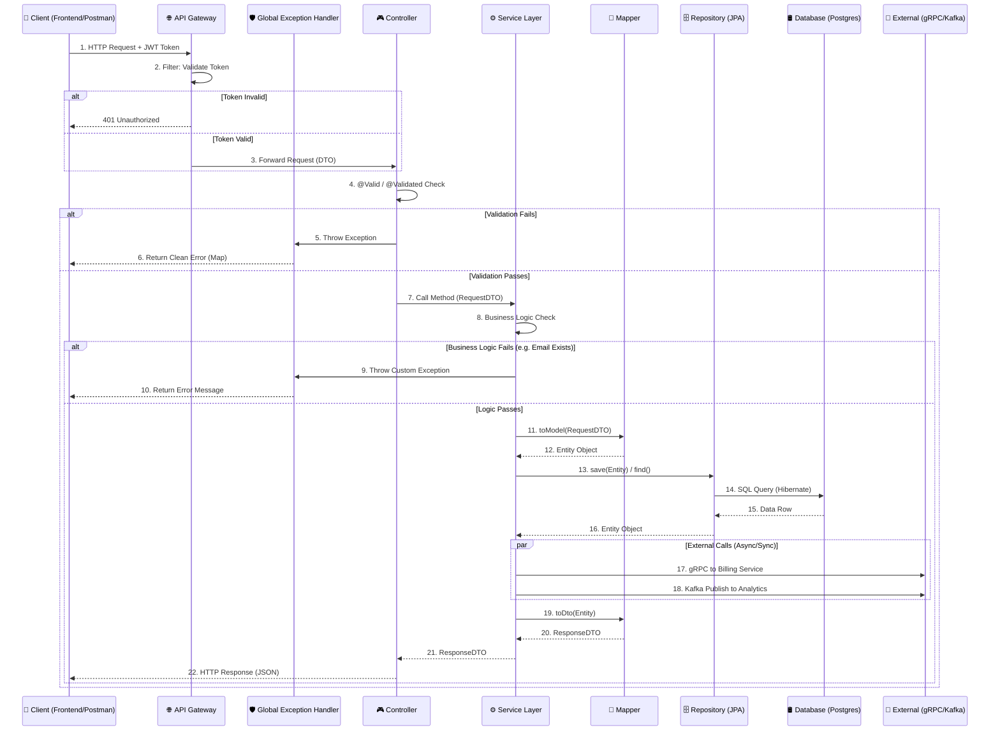

```mermaid
sequenceDiagram
    participant User as 👤 Client (Frontend/Postman)
    participant Gateway as 🌐 API Gateway
    participant Handler as 🛡️ Global Exception Handler
    participant Controller as 🎮 Controller
    participant Service as ⚙️ Service Layer
    participant Mapper as 🔄 Mapper
    participant Repo as 🗄️ Repository (JPA)
    participant DB as 🛢️ Database (Postgres)
    participant External as 📡 External (gRPC/Kafka)

    User->>Gateway: 1. HTTP Request + JWT Token
    Gateway->>Gateway: 2. Filter: Validate Token
    
    alt Token Invalid
        Gateway-->>User: 401 Unauthorized
    else Token Valid
        Gateway->>Controller: 3. Forward Request (DTO)
    end

    Controller->>Controller: 4. @Valid / @Validated Check
    
    alt Validation Fails
        Controller->>Handler: 5. Throw Exception
        Handler-->>User: 6. Return Clean Error (Map)
    else Validation Passes
        Controller->>Service: 7. Call Method (RequestDTO)
        
        Service->>Service: 8. Business Logic Check
        
        alt Business Logic Fails (e.g. Email Exists)
            Service->>Handler: 9. Throw Custom Exception
            Handler-->>User: 10. Return Error Message
        else Logic Passes
            Service->>Mapper: 11. toModel(RequestDTO)
            Mapper-->>Service: 12. Entity Object
            
            Service->>Repo: 13. save(Entity) / find()
            Repo->>DB: 14. SQL Query (Hibernate)
            DB-->>Repo: 15. Data Row
            Repo-->>Service: 16. Entity Object
            
            par External Calls (Async/Sync)
                Service->>External: 17. gRPC to Billing Service
                Service->>External: 18. Kafka Publish to Analytics
            end

            Service->>Mapper: 19. toDto(Entity)
            Mapper-->>Service: 20. ResponseDTO
            
            Service-->>Controller: 21. ResponseDTO
            Controller-->>User: 22. HTTP Response (JSON)
        end
    end
```